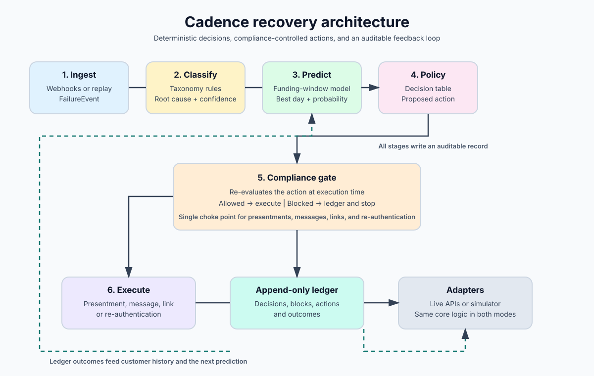

# Cadence

Cadence is a deterministic AI revenue-recovery system for failed recurring
debits such as UPI Autopay and e-NACH mandates. It predicts when a customer's
account is most likely to be funded, chooses a bounded intervention, and checks
every action against a compliance gate before execution.

## System architecture

Every failed debit moves through the same six-stage recovery loop:

1. **Ingest** normalises webhooks or replayed events into a `FailureEvent`.
2. **Classify** maps gateway and bank failure codes to a root cause using the
   deterministic taxonomy in `cadence/config/taxonomy.yaml`.
3. **Predict** estimates the customer's funding window and selects the most
   promising day. This stage is used for balance-shortfall causes, where timing
   can change the outcome.
4. **Policy** applies the decision table to the root cause, prediction, attempt
   count, and cycle state. It proposes an action such as a scheduled retry,
   pre-debit notice, payment link, or re-authentication request.
5. **Compliance gate** evaluates the proposed action at execution time. An
   allowed action continues; a blocked action is recorded with every failed
   check and stops there. No presentment or message bypasses this gate.
6. **Execute** sends the approved action through an adapter, then records the
   result in the append-only ledger. The outcome becomes history for future
   predictions.

The gate is intentionally the single choke point. Policy and prediction may
recommend an action, but only the gate can authorise it. This keeps the system
explainable and makes blocked actions first-class, auditable outcomes rather
than hidden failures.

## Execution modes

Cadence uses the same `core/` decision path in both modes:

- **Eval mode** uses a virtual clock and deterministic bank simulator so the
  baseline and agent can be compared on the same synthetic corpus.
- **Live mode** uses a real clock and Razorpay test-mode adapters for the demo.

Only the injected clock and execution adapters change. The simulator never
touches a live payment gateway, and every run accepts a seed for reproducible
results.

## Repository map

- `cadence/core/` contains ingest, classification, prediction, policy,
  compliance, execution, and ledger components.
- `cadence/sim/` contains the virtual clock, synthetic data generator, and bank
  outcome simulator.
- `cadence/eval/` runs baseline and agent evaluations and calculates metrics.
- `cadence/api/` exposes the FastAPI endpoints used by the dashboard.
- `web/` contains the Next.js dashboard.
- `docs/` contains the product, architecture, data model, compliance, and
  evaluation specifications.

## Stack

Python 3.11, FastAPI, Pydantic, SQLAlchemy, PostgreSQL, APScheduler, Next.js,
TypeScript, Tailwind, Recharts, and pytest.

See [docs/00-README.md](docs/00-README.md) for the documentation index and
[docs/02-ARCHITECTURE.md](docs/02-ARCHITECTURE.md) for the detailed architecture
specification.